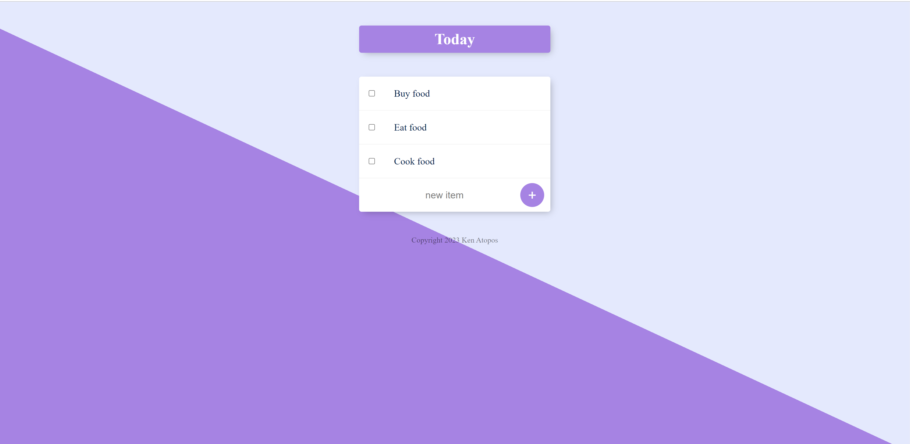

# To-Do List App
This is a simple to-do list app built with Node.js.

# Technologies Used
The following technologies were used in the creation of this app:

- Node.js
- Express
- EJS
- MongoDB

# Features
This app allows users to:

- Create a new to-do list item
- Edit an existing to-do list item
- Delete an existing to-do list item
- View a list of all existing to-do list items

# Installation
To install and run this app locally, follow these steps:

- Clone this repository to your local machine.
- Install the necessary dependencies by running `npm install` in the command line.
- Start the app by running `node app.js`.
- Visit http://localhost:3000 in your web browser to use the app.

